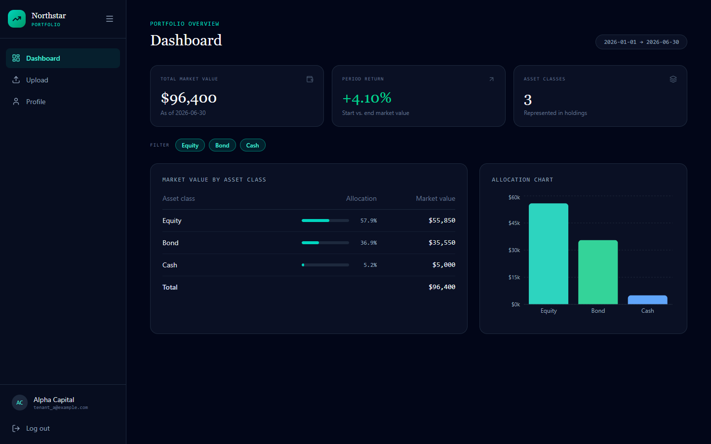
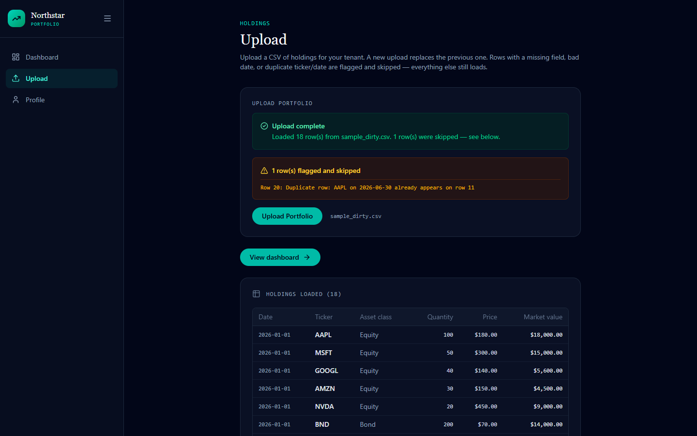

# Northstar Portfolio

A small multi-tenant investment tool. Each tenant logs in, uploads a CSV of holdings,
and sees market value by asset class plus the period return — with isolation enforced
server-side so one tenant can never read another's data.

**Stack:** React + TypeScript + Vite + Tailwind · Node.js + Express · PostgreSQL (Docker Compose)



## Run it

Requires Docker Desktop and Node.js 20+.

```bash
docker compose up -d --build
```

```bash
cd client && npm install && npm run dev
```

Open http://localhost:5173 and log in with either account — password `Password123!`:

| Email | Tenant |
|---|---|
| `tenant_a@example.com` | Alpha Capital |
| `tenant_b@example.com` | Beacon Advisors |

Upload `samples/sample_good.csv` to populate the dashboard, or `samples/sample_dirty.csv`
to see its one bad row flagged while the rest still loads.

Run the tests with `cd server && npm test` (13 tests covering the validators and the
return calculation).

## How it works

| Method | Route | Purpose |
|---|---|---|
| `POST` | `/api/auth/login` | Email + password, returns a JWT |
| `POST` | `/api/holdings/upload` | Multipart CSV, scoped to the caller's tenant |
| `GET` | `/api/holdings/summary` | Market value by asset class + period return |

**Tenant isolation.** The tenant id comes from the signed JWT only — never from a
request body, query string, or URL. Every statement touching `holdings` filters on it,
and all queries are parameterised, so there is no tenant id for a caller to tamper with.

**Period return.** `(end_market_value - start_market_value) / start_market_value`, using
the earliest and latest dates in the data. One pure function in `server/calculations.js`.

**CSV validation.** Rules live in `server/validateCsv.js`, one named function each:
missing fields, invalid dates, negative numbers, and duplicate ticker+date. The brief
allows "reject or flag" — this app flags: bad rows are excluded and reported by row
number and reason, while every valid row still loads. Only a file with zero valid rows
fails outright.



**Configuration.** Everything lives in `.env.example` — credentials, ports, the JWT
secret, and the seed password. `docker-compose.yml` uses `${VAR:-default}` fallbacks, so
the stack runs with no `.env` at all; copy it only to change something. Users are seeded
on API startup by `server/seed.js`, which hashes `SEED_PASSWORD` with bcrypt at seed
time rather than storing a hash in the repo.

## Assumptions

1. The asset-class breakdown reflects the **latest date** in the data, not a sum across
   all dates — consistent with how the period return is defined.
2. Each upload **replaces** that tenant's holdings rather than appending, so re-uploading
   corrects the data instead of double-counting it.
3. Auth uses a **JWT bearer token** in `localStorage`, with an 8-hour expiry.

## With more time

- Integration tests for the API routes; only the pure functions are covered today.
- `httpOnly` cookies instead of `localStorage`, removing the XSS token-theft risk.
- Serve the built client via Nginx rather than `vite dev`.
- Batch the upload inserts into one statement — fine at this size, but it would matter
  for large files.
